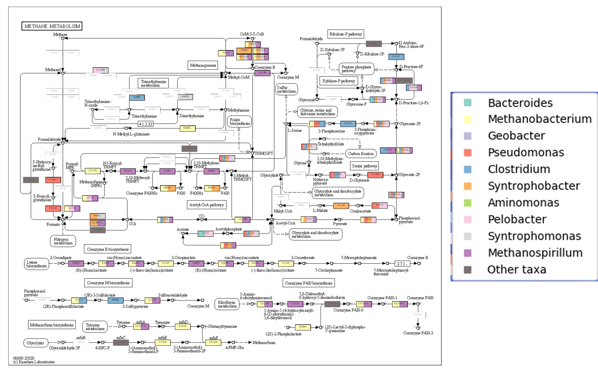
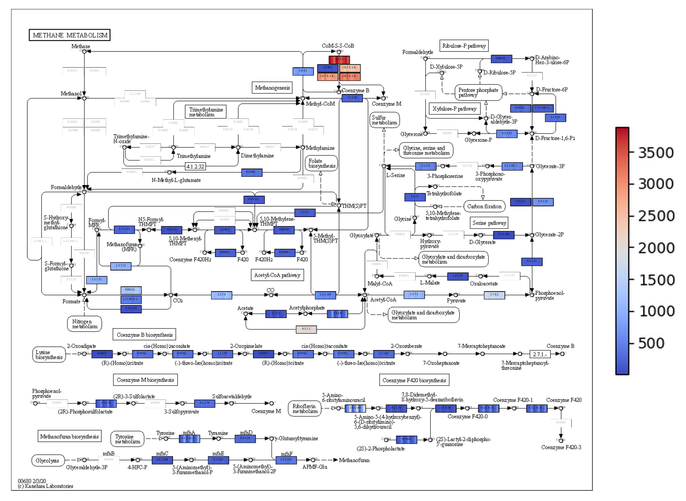

# KEGGCharter

A tool for representing genomic potential and transcriptomic expression into KEGG pathways.

* [Features](https://github.com/iquasere/KEGGCharter#features)
* [Installation](https://github.com/iquasere/KEGGCharter#installation)
* [Running KEGGCharter](https://github.com/iquasere/KEGGCharter#running-keggcharter)
* [Outputs](https://github.com/iquasere/KEGGCharter#outputs)
* [Arguments for KEGGCharter](https://github.com/iquasere/KEGGCharter#arguments-for-keggcharter)
* [Referencing KEGGCharter](https://github.com/iquasere/KEGGCharter#referencing-keggcharter)


## Features

KEGGCharter is a user-friendly implementation of KEGG API and Pathway functionalities. It allows for:
* Conversion of KEGG IDs, EC numbers and COG IDs to KEGG Orthologs (KO) and of KO to EC numbers
* Representation of the metabolic potential of the main taxa in KEGG metabolic maps (each distinguished by its own colour)
* Representation of differential expression between samples in KEGG metabolic maps (the collective sum of each function will be represented)

## Installation

KEGGCharter can be easily installed with Bioconda.
```
conda install -c conda-forge -c bioconda keggcharter
```

## Running KEGGCharter

To run KEGGCharter, an input file must be supplied. This file only needs to contain one column with either KEGG IDs, KOs or EC numbers. Beyond that:
* to obtain distinct taxonomic identifications in the maps, a column with taxonomic identification must be specified with the `-tcol` parameter. If no such column exists, KEGGCharter must be run with the `-it` parameter.
* to obtain maps with differential expression, at least one column with genomic and/or transcriptomic quantification must be specified with the `-qcol`parameter. If no such column exists, KEGGCharter must be run with the `-iq` parameter.

An example input file is available [here](https://github.com/iquasere/KEGGCharter/blob/master/cicd/keggcharter_input.tsv). 
It contains all fields referenced above, and should be used as guidance for building inputs for KEGGCharter.
The following command will obtain metabolic representations for "Methane Metabolism" (KEGG map00680) with KEGGCharter:
```
keggcharter -f keggcharter_input.tsv -rd resources_directory -keggc 'KEGG' -koc 'KO' -ecc 'EC number' -cogc 'COG ID' -iq -it "My community" -mm 00680 -o first_time_running_KC
```
After it is over, you should have, inside the `first_time_running_KC` folder:
* additional information concerning your data in the file `KEGGCharter_results.tsv`
* maps in PNG format inside a `maps` folder
* JSONs with the information painted on the maps inside a `json` folder 

Additionally, you should have the `data_for_charting.tsv` and `taxon_to_mmap_to_orthologs` files. These are there so KEGGCharter can be run again, for other maps, by running the same command as before, but with the additional parameter `--resume`. With this parameter, KEGGCharter will look for those files, and new maps can be generated by changing the `--metabolic-maps` parameter. No need for repeated KOs and EC numbers retrieval!

### What maps are available?

You can see what maps are available for the `--metabolic-maps` parameter by running `keggcharter --show-available-maps`.

### First time KEGGCharter runs it will take a long time

KEGGCharter needs KGMLs and EC numbers to boxes relations, which it will automatically retrieve for every map inputted. 
This might take some time, but you only need to run it once. 

Default directory for storing these files is the folder containing the `keggcharter` script, but it can be customized
with the `-rd` parameter.

## Outputs

KEGGCharter produces a table from the inputed data with two new columns - KO (KEGG Charter) and EC number (KEGG Charter) - containing the results of conversion of KEGG IDs to KOs and KOs to EC numbers, respectively. This file is saved as ```KEGGCharter_results``` in the output directory. 
KEGGCharter then represents this information in KEGG metabolic maps. If information is available as result of (meta)genomics analysis, KEGGCharter will localize the boxes whose functions are present in the organisms' genomes, mapping their genomic potential. If (meta)transcriptomics data is available, KEGGCharter will consider the sample as a whole, measuring gene expression and performing a multi-sample comparison for each function in the metabolic maps.
* maps with genomic information are identified with the prefix "potential_" from genomic potential (Fig. 1).


Fig. 1 - KEGG metabolic map of methane metabolism, with identified taxa for each function from a simulated dataset.

* maps with transcriptomic information are identified with the prefix "differential_" from differential expression (Fig. 2).


Fig. 2 - KEGG metabolic map of methane metabolism, with differential analysis of quantified expression for each function from a simulated dataset.

## Arguments for KEGGCharter

KEGGCharter provides several options for customizing its workflow.
```
  -h, --help            show this help message and exit
  -f FILE, --file FILE  TSV or EXCEL table with information to chart
  -o OUTPUT, --output OUTPUT
                        Output directory
  -rd RESOURCES_DIRECTORY, --resources-directory RESOURCES_DIRECTORY
                        Directory for storing KGML and CSV files.
  -mm METABOLIC_MAPS, --metabolic-maps METABOLIC_MAPS
                        IDs of metabolic maps to output
  -qcol QUANTIFICATION_COLUMNS, --quantification-columns QUANTIFICATION_COLUMNS
                        Names of columns with quantification
  -tls TAXA_LIST, --taxa-list TAXA_LIST
                        List of taxa to represent in genomic potential charts (comma separated)
  -not NUMBER_OF_TAXA, --number-of-taxa NUMBER_OF_TAXA
                        Number of taxa to represent in genomic potential charts (comma separated)
  -keggc KEGG_COLUMN, --kegg-column KEGG_COLUMN
                        Column with KEGG IDs.
  -koc KO_COLUMN, --ko-column KO_COLUMN
                        Column with KOs.
  -ecc EC_COLUMN, --ec-column EC_COLUMN
                        Column with EC numbers.
  -cogc COG_COLUMN, --cog-column COG_COLUMN
                        Column with COG IDs.
  -tc TAXA_COLUMN, --taxa-column TAXA_COLUMN
                        Column with the taxa designations to represent with KEGGCharter. NOTE - for valid taxonomies, check: https://www.genome.jp/kegg/catalog/org_list.html
  -iq, --input-quantification
                        If input table has no quantification, will create a mock quantification column
  -it INPUT_TAXONOMY, --input-taxonomy INPUT_TAXONOMY
                        If no taxonomy column exists and there is only one taxon in question.
  -t THREADS, --threads THREADS
                        Number of threads to run KEGGCharter with [max available]
  --step STEP           Number of IDs to submit per request through the KEGG API [40]
  --map-all             Ignore KEGG taxonomic information. All functions for all KOs will be represented, even if they aren't attributed by KEGG to the specific species.
  --include-missing-genomes
                        Map the functions for KOs identified for organisms not present in KEGG Genomes.
  --resume              If data inputed has already been analyzed by KEGGCharter.
  -v, --version         show program's version number and exit

Special functions:
  --show-available-maps
                        Outputs KEGG maps IDs and descriptions to the console (so you may pick the ones you want!)
```

### Mock imputation of quantification and taxonomy

Sometimes, not all information required for KEGGCharter will be available. 
In these cases, KEGGCharter may use mock imputations of quantification and/or taxonomy.

To input mock quantification, run with the ```--input-quantification``` parameter. This will attribute a quantification 
of 1 to every protein in the input dataset.
This replaces the ```--genomic-columns``` parameter.

To input mock taxonomy, run with the ```--input-taxonomy [mock taxonomy]``` parameter, where ```[mock taxonomy]``` 
should be replaced with the value to be presented in the maps. This will attribute that taxonomic classification to 
every protein in the input dataset, which might be useful to, for example, represent "metagenome" in the genomic 
potential maps.
This replaces the ```--taxonomic-columns``` parameter.

### Handling missing information in KEGG Genomes

KEGGCharter attempts to download taxa specific KGMLs for organisms in [KEGG Genomes](https://www.genome.jp/kegg/catalog/org_list.html), and use them to determine which functions are available for which organisms. Since KOs are promiscuous, the same KO will likely map for functions that organisms have available in their genomes, and for functions not available for them. Using this workflow of KEGGCharter will produce maps such as the example in Fig. 3.


Fig. 3 - Original KEGGCharter workflow. Only _arcticus_ had KOs with functions for the TCA cycle attributed that, simultaneously, were present in the KGML for the TCA cycle and the taxon _arcticus_.

This type of workflow uses both taxon-specific information and results from the datasets inputted. All functions represented validated by KEGG (i.e., those functions are available for those organisms), but many identifications may be lacking, since information at KEGG is often incomplete.

#### Setting "--include-missing-genomes" represents organisms that are not in KEGG Genomes

Organisms that are not identified in KEGG Genomes can still be represented, if running KEGGCharter with the option `--include-missing-genomes`. All functions for the KOs identified for that organism will be represented (Fig. 4).


Fig. 4 - KEGGCharter output expanded with `--include-missing-genomes` parameter. _hydrocola_ is not present in KEGG Genomes, but all functions attributed to its KOs are still represented.

This setting allows to still obtain validated information for the taxonomies that are present in KEGG Genomes, while also allowing for representation of organisms not present in KEGG Genomes. It should offer the best compromise between false positives and false negatives.

#### Setting "--map-all" ignores KEGG Genomes completely, and represents all functions identified

Functions that are not present organisms specific KGMLs can still be represented, if running KEGGCharter with the option `--map-all`. This will bypass all taxon specific KGMLs, and map all functions for all KOs present in the input dataset (Fig. 5).


Fig. 5 - KEGGCharter output expanded with `--map-all` parameter. No functions for _oleophylus_ and _franklandus_ were simultaneously present in the KOs identified and available in their KGMLs. In this case, the requirement for presence in the KGMLs is bypassed, and all functions are represented for all taxa.

This setting represents the most information on the KEGG maps, and will produce the most colourful representations, but will likely return many false positives. Maps produced should be analyzed with caution This setting may be required, however, if information for organisms in KEGG Genomes is very incomplete.

## Referencing KEGGCharter

If you use KEGGCharter, please cite its [publication](https://www.sciencedirect.com/science/article/pii/S2001037022001179).